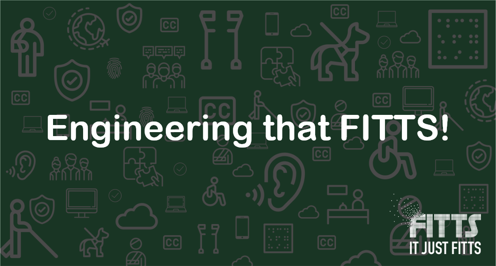

### What is Engineering at FITTS?
***
The **Technology Strategy Board** is the engine of scale at FITTS with a strategic focus on capturing data, putting things into systems and increasing productivity.

The **Engineering Team** at FITTS drives the implementation and delivery of improvements to that engine, and focuses on delivering solutions faster and in a scalable way.

### Quick Links
***

- [Communication](https://github.com/FITTS-ItJustFitts/Engineering-PlayBook/tree/master/src/Communication)
- [Scrum Ceremonies](https://github.com/FITTS-ItJustFitts/Engineering-PlayBook/tree/master/src/Scrum%20Process/Scrum%20Ceremonies)
- [Stories Estimation](https://github.com/FITTS-ItJustFitts/Engineering-PlayBook/tree/master/src/Scrum%20Process/Estimation)
- [Development](https://github.com/FITTS-ItJustFitts/Engineering-PlayBook/tree/master/src/Development)
- [Engineering Values](https://github.com/FITTS-ItJustFitts/Engineering-PlayBook/tree/master/src/Engineering%20Values)
- [Laptop setup](https://github.com/FITTS-ItJustFitts/Engineering-PlayBook/tree/master/src/Laptop%20Setup)
- [Repositories]()

***